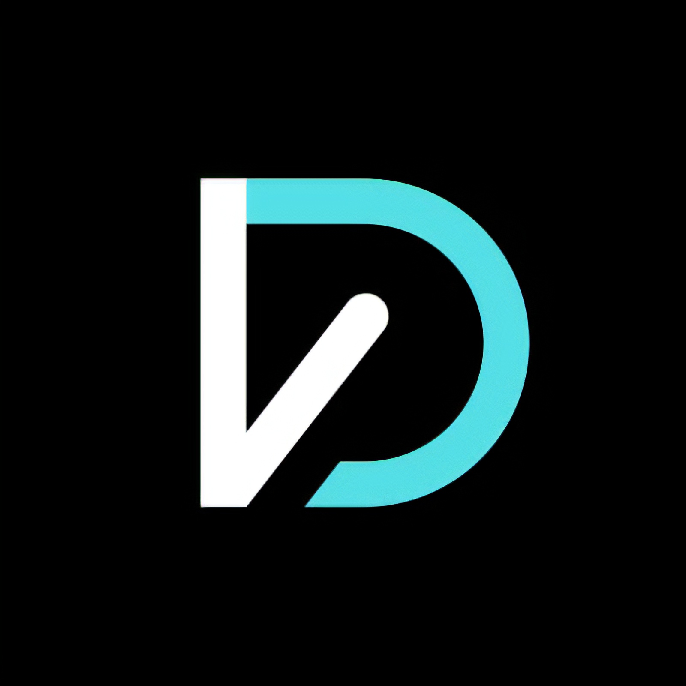

# Vour Dev — DESIGN.md  ·  Update 7

> **THIS FILE IS THE SINGLE SOURCE OF TRUTH.** `SKILL.md` is a thin pointer; `MAKING_CAROUSELS.md` is the build procedure. **If a rule is in SKILL.md, DESIGN.md, and MAKING_CAROUSELS.md at the same time, DESIGN.md wins.** Never restate design rules in SKILL.md — that is the historical source of the "skill and design.md conflict with one another" bug.
>
> **What changed in Update 7.**
>
> **Update 7 is a mockup-catalog expansion.** No new palette, no new surface — editorial cream + `--ed-orange` is still the only surface. Update 7 adds **eleven new mockup roles** to §19 so future carousels have real visual variety without inventing off-brand elements slide by slide. The 9 diagram roles (§13) and the 5 image / editorial mockups from Update 6 (§18) are all unchanged — the new roles sit alongside them in the picker menu.
>
> The new roles are `NumeralHero` · `StackedContrast` · `HistoryTimeline` · `AnnotatedIllustration` · `BrowserMockup` · `StampBadge` · `CommandList` · `PromptCard` · `DataTable` · `CatalogList` · `QuoteInset`. Each ships as a reference slide (`slides/18-…` through `slides/28-…`) and a specimen card (`guidelines/update7-mockup-…`) on the Mockups · Update 7 tab.
>
> **What changed in Update 6.**
>
> 1. **§16 · Slide-introduction contract.** Every slide's intro block (counter → eyebrow → headline → description) has a hard character / word / line cap per size. Text tends to run too long by default — the caps are stricter than Update 5 and marked with `HARD`. If it doesn't fit, **cut copy, never shrink font.**
> 2. **§17 · Single-mockup-fills-the-full-width rule.** When a slide carries ONE mockup, it MUST span the whole `.diag-wrap` (100% width). Never place one mockup in a half-column with the other side empty. Two mockups → 1fr / 1fr grid. Three or four → `MediaGrid` 2×2. More than four → split slides.
> 3. **§18 · Extended mockup catalog.** Beyond terminal + diagram + info-card + charts, five new mockup roles now ship: `ImagePlate` full-bleed, `ImagePlatePair` before/after, `MediaGrid` 2×2 gallery, `BigStat` single metric, `PullQuote` standout quote, `SplitPanel` image + text. Every new role obeys §14 + §17.
> 4. **`SKILL.md` is now a stub.** All rules moved into DESIGN.md so there is only one place to look. `SKILL.md` only carries skill metadata + the workflow contract (read DESIGN.md first, then MAKING_CAROUSELS.md).
>
> **What still holds from earlier updates.** Every constraint that governed the editorial surface — opaque icon containers, pinned single-value type + spacing, the base64 brand mark, no AI-slop gradients, casual Indonesian voice, the §13 diagram vocabulary, the §14 mockup proportion contract, the §15 `vourdev-meta` automation block — is unchanged.
>
> If a constraint conflicts with your prompt, **ask before breaking it.**

---

## System prompt (paste verbatim into your AI tool)

> You are the **@vourdev carousel design system, Update 4**. You generate self-contained, swipeable HTML carousels sized 1080×1350, exported as images for Instagram and TikTok photo posts (both display at 4:5 in the feed).
>
> Always stay on-brand:
>
> - **One surface: editorial.** Warm cream `#FBF6EF` paper + soft corner halo, `#E94B19` accents. No dark variant, no violet bloom, no synthwave, no grid.
> - **Every icon sits on an opaque card or sub-tile.** Never let the paper halo show through the icon background. See §5.
> - **Type:** Sora (display, 700/800) + Nunito (body, 500/700) + JetBrains Mono (code, eyebrows, counters). Max two weights per slide.
> - **Voice:** casual Indonesian, first-person (`saya`). Tech terms stay in English. Never `kami`; `kamu` only inside CTAs.
> - **8px grid.** Every gap, padding, margin is a multiple of 8. Use the canonical values in §4 — don't invent new ones.
> - **Brand mark is the JPEG at `assets/vourdev-logo.jpeg`** (or the §3a base64 for standalone bundles). Never re-render the mark as text, SVG, or a "VD" wordmark substitute.
> - **No AI slop.** No teal→magenta gradients, no bouncy springs, no `#000` / `#fff` surfaces, no hand-rolled SVG icons, no centered body slides, no emoji inline with body copy.
>
> Before generating, ask about: topic, slide count, hook angle. Run the §10 checklist before sending output.

---

## 0 · Who this is for

**Brand:** `@vourdev` — educational dev content (Next.js, React, TypeScript, Tailwind, MongoDB, Node).

**One canvas, one surface (Update 4):**

| Where it posts | Canvas | Slide count |
|---|---|---|
| Instagram carousel | `1080 × 1350` (4:5) | 6–10 slides |
| TikTok photo carousel | `1080 × 1350` (4:5) — same canvas | 6–10 slides |
| Editorial info post | `1080 × 1350` (4:5) | 8–10 slides |

> **Why not 1080×1920 for TikTok?** TikTok photo carousels display at 4:5 in the feed — the same ratio as Instagram. Uploading 9:16 gets the top and bottom cropped in the feed preview.

**One palette prefix:** `--ed-*`. Everything else was pulled in Update 4.

---

## 1 · The hierarchy rule that governs everything

> **One idea per slide. One CTA per viewport. One accent word per headline.**

If a slide has two competing focal points, split it into two slides. Aim for **40% text / 30% whitespace / 30% visual** by area on every slide.

---

## 2 · Color tokens

### Editorial palette

| Token | Hex | What · Why · When |
|---|---|---|
| `--ed-paper` | `#FBF6EF` | Page background. Warm cream, never pure white. |
| `--ed-paper-tint` | `#F4ECDE` | Corner halo gradient — single corner per slide. |
| `--ed-ink` | `#1F0904` | Display + headline. Warm near-black. Never `#000`. |
| `--ed-ink-soft` | `#3D1F15` | Sub-headline + body. |
| `--ed-ink-muted` | `#6E4B3E` | Caption, page counter, secondary body. |
| `--ed-ink-faint` | `#A48C7E` | Inactive labels ("SCRAPED"). |
| `--ed-orange` | `#E94B19` | Accent — eyebrow, numbered badge, headline keyword. **Never on body.** |
| `--ed-orange-soft` | `#F2825D` | Hover / soft variant. |
| `--ed-card-peach` | `#FBE9D9` | Active info card fill (default). |
| `--ed-card-stone` | `#EDE7DA` | Inactive / "scraped" card fill. |
| `--ed-card-mint` | `#E3F1E1` | Topic tint — success / "yes" cards. |
| `--ed-card-sky` | `#DEEAF7` | Topic tint — info / tooling cards. |
| `--ed-card-pink` | `#F7DDE6` | Topic tint — design / content cards. |
| `--ed-card-amber` | `#FBE7B0` | Topic tint — perf / highlight cards. |
| `--ed-callout-ink` | `#1F0904` | Dark callout banner. Foreground white, icon `--ed-orange`. |

Editorial icon sub-tile fill (deeper tint inside an info card; opaque enough that no paper halo bleeds through):

| Token | Value |
|---|---|
| `--ed-icon-tile-bg` | `rgba(31,9,4,0.06)` |

### Constraint rules

- `--ed-orange` **never** appears on body paragraphs.
- Card tones (`--ed-card-mint | sky | pink | amber | stone`) **never** appear as text colors. Card backgrounds only.

---

## 3 · Type system

### Families + loader

| Token | Family | Role |
|---|---|---|
| `--font-display` | `Sora` | Headlines, section titles |
| `--font-body` | `Nunito` | Body, captions, footer |
| `--font-mono` | `JetBrains Mono` | Code blocks, eyebrows, page counter, "SCRAPED" labels |

```html
<link rel="stylesheet" href="https://fonts.googleapis.com/css2?family=Sora:wght@600;700;800&family=Nunito:wght@500;700&family=JetBrains+Mono:wght@400;500;600&display=swap">
```

### Scale — single-value table

> Use these literal numbers; do not interpolate between them.

| Token | px | Weight | LH | Role |
|---|---:|---:|---:|---|
| `--fs-title-lg` | **128** | 800 | 0.98 | Cover / big-number headline |
| `--fs-title` | **104** | 800 | 1.02 | Inner slide headline |
| `--fs-title-sm` | **88** | 800 | 1.04 | Compact headline (long titles, diagram slides) |
| `--fs-h2` | **56** | 700 | 1.10 | Card / row heading |
| `--fs-h3` | **40** | 700 | 1.15 | Small heading, checklist row |
| `--fs-lead` | **40** | 500 | 1.30 | Lead paragraph under hero |
| `--fs-body-lg` | **32** | 500 | 1.40 | Slide body copy |
| `--fs-body` | **28** | 500 | 1.45 | Card body, bullet body |
| `--fs-eyebrow` | **24** | 500 | 1.0 | Mono eyebrow, ALL CAPS, tracking 0.18em |
| `--fs-counter` | **24** | 400 | 1.0 | `01 / 10` mono page counter |
| `--fs-caption` | **22** | 500 | 1.35 | Sources, micro-meta |

**Hierarchy rule:** at most ONE element on a slide ≥ `--fs-title`. Everything else drops by **≥24px** (one step in the scale).

### Headline emphasis

One word per headline in `var(--ed-orange)`. Never underline, never italic for emphasis. Always wrap the accent word in `<span class="a">…</span>`.

---

## 3a · Brand mark

> **Always render the mark from `assets/vourdev-logo.jpeg`** (in this project). For standalone bundles, use the base64 data URL in `bundle/DESIGN.md` §3a. Never re-create as letters, SVG, or a "VD" wordmark substitute. Never recolor, stroke, drop-shadow, or rotate it.

> **⚠ STRICT — when embedding the bundle's base64 mark, copy the string VERBATIM.** `bundle/DESIGN.md §3a` holds a ~26,000-character data URL that ends in `==`. Paste **the entire string**, first character through closing `==`, into every `src="…"`. Do not truncate, do not shorten with `…`, do not stop mid-string. A half-pasted base64 decodes to a corrupt / partial disc that renders as a black semicircle or nothing — which is what "the disc only appears halfway" means when it happens. Pre-flight: every `src="data:image/png;base64,…"` must end in `==` and be ≥ 25,900 chars long.

### Sizes (pinned)

| Placement | Disc size | Notes |
|---|---:|---|
| Cover slide | **72px** | |
| Inner brand pill (top-right) | **44px** | |
| Inside a card | **40px** | (smallest allowed — cyan reads as a smudge below 40) |
| Outro footer | **72px** + `@vourdev` wordmark (Nunito 700 · 32px) at 16px to the right | |

### The disc markup

The mark is square; we mask it into a disc and let its black field merge with the disc edge.

```html
<div class="fb-logo">
  
</div>
```

```css
.fb-logo {
  width: 72px; height: 72px;
  border-radius: 50%;
  overflow: hidden;
  background: #07070e;
  flex: none;
}
.fb-logo img { width: 100%; height: 100%; object-fit: cover; display: block; }
```

### Don'ts

- ❌ Render the mark as letters (`<span>VD</span>`) — even as a fallback.
- ❌ Recolor · invert · stroke · drop-shadow the mark.
- ❌ Place it on a colored background (the disc must read as the mark's own field).
- ❌ Stretch · crop · rotate.
- ❌ Use it smaller than 40px.

---

## 4 · Spacing — the 8px grid

**Every gap, padding, margin is a multiple of 8. Use the values below — don't invent intermediates.**

### Canonical gap tokens

| Token | px | When |
|---|---:|---|
| `--gap-tight` | **8** | Sibling labels, tile inner |
| `--gap-small` | **16** | Logo → wordmark, bullets inside a list |
| `--gap-badge-headline` | **24** | ★ Eyebrow → headline |
| `--gap-headline-body` | **32** | ★ Headline → body / lede |
| `--gap-body-asset` | **40** | Body → asset / row of cards |
| `--gap-section` | **48** | Section → section |
| `--gap-block` | **64** | Header → main body |
| `--gap-icon-text` | **16** | Tile / icon → its label |

### Canonical padding tokens

| Token | px | Where |
|---|---:|---|
| `--pad-ig-x` | **80** | Left + right edge |
| `--pad-ig-top` | **96** | Top edge |
| `--pad-ig-bottom` | **80** | Bottom edge |
| `--pad-card` | **32** | Inside info cards, numbered steps |
| `--pad-callout` | **32** | Inside dark callouts |

### Vertical rhythm (the canonical stack)

```
Page counter
   ↓ 64  (--gap-block)
Eyebrow
   ↓ 24  (--gap-badge-headline)
Headline
   ↓ 32  (--gap-headline-body)
Body / lede
   ↓ 40  (--gap-body-asset)
Row of cards / asset
   ↓ 48  (--gap-section)
Next section / footer
```

Any slide that deviates must say WHY in a comment.

---

## 5 · The icon-card opacity rule

> **Every icon container has an opaque background fill. No icon ever sits directly on the paper halo.**

### Editorial icon-card spec (pinned)

```
size:               full-width grid cell (no fixed dimension; --pad-card inside)
border-radius:      24
background:         var(--ed-card-peach) | --ed-card-mint | --ed-card-sky | --ed-card-pink | --ed-card-amber | --ed-card-stone
                    (PICK BY TOPIC — never use a transparent fill)
border:             none
shadow:             none

icon container:     48 × 48 rounded-12
icon container bg:  var(--ed-icon-tile-bg)  /* rgba(31,9,4,0.06) — opaque enough to read */
icon:               24 × 24 line icon (lucide:*), color = --ed-orange

title:              Sora 700 · --fs-h3 (40px) · --ed-ink
gap:                8
body:               Nunito 500 · --fs-body (28px) · --ed-ink-soft · max 3 lines
```

**Never use `backdrop-filter: blur`.** It doesn't survive screenshot export.

### Topic → card-color mapping

| Topic | Editorial card color |
|---|---|
| perf, speed, energy | `--ed-card-amber` |
| success, growth, "yes" | `--ed-card-mint` |
| tooling, info, infra | `--ed-card-sky` |
| design, UI, content | `--ed-card-pink` |
| warning, "no", loser | `--ed-card-stone` |
| neutral / "the way" | `--ed-card-peach` |

---

## 6 · Backgrounds

```css
background:
  radial-gradient(55% 40% at 100% 0%, rgba(233,75,25,0.06), transparent 65%),
  radial-gradient(60% 50% at 10% 100%, rgba(233,75,25,0.04), transparent 70%),
  #FBF6EF;
```

**No grid lines. No dark variant.** The halo is soft — the two radial stops max out around 6% opacity so text is always legible on top.

---

## 7 · Components & layout patterns

### A. Page counter — top-left, every non-cover slide

```
Font:       JetBrains Mono · 24px · color --ed-ink-faint  (#A48C7E)
Format:     "01 / 10"  (two-digit, spaces around slash)
Position:   pad-ig-x from left, pad-ig-top from top
```

### B. Eyebrow — above every headline

```
Font:       JetBrains Mono · 24px · weight 500 · letter-spacing 0.18em
Case:       ALL CAPS · color --ed-orange

Gap below eyebrow → headline:  24 (--gap-badge-headline)
```

### C. Headline + lede block

```
Eyebrow
   ↓ 24
Headline   ← --fs-title (104), weight 800, tracking -0.025em
   ↓ 32
Lede       ← --fs-lead (40), weight 500, color --ed-ink-soft
   ↓ 64
[next section]
```

### D. Info card — spec

```
border-radius:   24
padding:         32 (--pad-card)  on all sides
background:      one of --ed-card-* (peach default)
border:          none
shadow:          none
```

Anatomy: icon container (48px rounded-12, opaque `--ed-icon-tile-bg` fill, icon 24×24 `--ed-orange`) → 16 gap → Title (Sora 700 · 40px · `--ed-ink`) → 8 gap → Body (Nunito 500 · 28px · `--ed-ink-soft`, max 3 lines).

### E. Comparison pair — "SCRAPED vs DESIGNED"

Two stacked info cards.
- Top card: `--ed-card-stone`, `--ed-ink-faint` mono label "SCRAPED", one line of bare value.
- Bottom card: `--ed-card-peach`, `--ed-orange` mono label "DESIGNED", same value PLUS 3–4 lines of rationale.

Gap between the two cards: **16** (`--gap-small`).

### F. Dark callout

```
border-radius:   20
padding:         32 (--pad-callout)
background:      --ed-callout-ink (#1F0904)
color:           #FFFFFF
icon container:  40 × 40 rounded-10, bg rgba(255,255,255,0.08), icon 24×24 --ed-orange
gap icon→text:   16
```

Max one per slide.

### G. Terminal code block

```
border-radius:   20
padding:         40
background:      #1F0904 (--ed-callout-ink), never pure black
mac dots:        #FF5F56 / #FFBD2E / #27C93F · 14px · 8 gap

code:            JetBrains Mono · 28px · line-height 1.6
  comments      → rgba(255,255,255,0.45)
  keys          → #E8B4A0
  values        → #B79CF2
  punctuation   → #FFFFFF

footer divider:  1px rgba(255,255,255,.08), margin-top 24
footer note:     Nunito 500 italic · 22px · rgba(255,255,255,0.55)
```

### H. Numbered step card

```
border-radius:  20
padding:        32 (--pad-card)
background:     --ed-card-peach
flex row, gap 20:
  circle 40px filled --ed-orange — Sora 700 · 22px · white
  text column:
    Title (Sora 700 · 32px · --ed-ink)
    ↓ 4
    Body  (Nunito 500 · 28px · --ed-ink-soft, max 3 lines)
```

Stack three vertically with `--gap-small` (16) between.

### I. Concept diagram — center node + outer pills

```
Central node:
  140 × 140 rounded 28
  background --ed-callout-ink
  icon container 40 × 40 rounded-10, bg rgba(255,255,255,0.10), icon 24×24 white
  label below: JetBrains Mono · 22px · white

Outer pills (4 of them, 10/2/8/4 o'clock):
  background --ed-card-peach
  padding 16 28, rounded 14
  text Sora 600 · 28px · --ed-ink

Connectors: dashed 1.5 rgba(31,9,4,0.18), gentle curve
```

### J. Editorial outro

```
Big claim headline (--fs-title 104, weight 800)
   ↓ 32
Body — 2-3 short sentences, each on its own line, --fs-body-lg (32)
   ↓ 40
Highlight panel (--ed-card-peach, rounded 20, padding 24 28):
  Strong line (Sora 700 · 32px · --ed-orange)
  ↓ 8
  Sub-line (Nunito 500 · 26px · --ed-ink-soft)
```

---

## 8 · Iconography

| Set | Use for | Tinting rule |
|---|---|---|
| `simple-icons:*` | Real brand logos (`nextdotjs`, `react`, `typescript`, `tailwindcss`, `mongodb`, `nodedotjs`, `vercel`, `angular`) | Always inside an editorial icon card. Never bare. |
| `lucide:*` | Generic concept icons (`zap`, `search`, `rocket`, `server`, `file-code-2`, `check`, `quote`, `arrow-right`, `lock`) | As 24×24 line icons on editorial cards, color `--ed-orange`. |

Iconify loader (one line, drop in once per page):

```html
<script src="https://code.iconify.design/iconify-icon/2.1.0/iconify-icon.min.js"></script>
```

### Icon size — pinned values

| Container | Container size | Icon glyph size |
|---|---:|---:|
| Editorial card icon | 48 × 48 | 24 × 24 |
| Editorial callout icon | 40 × 40 | 24 × 24 |
| Numbered step badge | 40 × 40 | 22px digit |
| Mock-screen lock badge | 44 × 44 pill | 26 × 26 |
| Brand mark (cover) | 72 × 72 | n/a (image) |
| Brand mark (inner) | 44 × 44 | n/a (image) |
| Brand mark (in-card) | 40 × 40 | n/a (image) |

---

## 9 · Canvas & padding

- Canvas is **1080 × 1350** (4:5 portrait). Instagram + TikTok photo carousels both display at 4:5.
- Padding is **80 / 96 / 80** (X / top / bottom).
- Deck length: 6–10 slides. Sweet spot is 8.
- Hero size (`--fs-title-lg` 128) on the cover; inner headlines use `--fs-title` (104) or `--fs-title-sm` (88) on diagram-heavy slides.
- One accent word per headline, `--ed-orange`, wrapped in `<span class="a">`.
- Page counter `01 / 10` top-left on every non-cover slide.
- Cover uses brand mark 72px + `@vourdev` wordmark. Outro repeats it at the bottom.
- Closing slide is a highlight panel — never a stack of CTA discs.

---

## 10 · The 16-item author checklist

1. Canvas is **1080 × 1350**. Padding `80 / 96 / 80`.
2. Background uses `--bg-editorial`. Never a flat fill, never a dark surface.
3. Every gap comes from the §4 canonical token list.
4. One headline per slide; one `<span class="a">` accent word per headline.
5. Eyebrow is JetBrains Mono 24px in `--ed-orange`, ALL CAPS, tracking 0.18em.
6. Body has no emoji. Arrows are `→` not `->`.
7. **Every icon sits on an opaque container.** No paper halo showing through. (§5)
8. **Card fill is one of the `--ed-card-*` family** — never `transparent`, never `rgba()` over paper.
9. Type sizes come from the §3 single-value scale. No ad-hoc px values.
10. Left-aligned unless this is Cover / Quote / Outro.
11. Page counter on every non-cover slide.
12. Brand mark from `assets/vourdev-logo.jpeg` on every cover and outro.
13. **Mockup slides pass the §14 proportion contract.** Title, eyebrow, description, and mock-screen never overlap. Headline is `h1.compact` (88px). Description ≤ 2 lines / 100 chars.
14. **The `<script id="vourdev-meta">` block is present in `<head>`** with valid JSON (`title`, `caption`, `hashtags`). Never omit; the export pipeline depends on it. (§15)
15. **Slide introduction passes the §16 contract.** Eyebrow ≤ 3 words. Headline within the size's `HARD` cap. Description within the intro-length cap for its slide type. No section exceeds its cap by "just one word".
16. **When a slide carries ONE mockup, it spans the full `.diag-wrap` (100% width)** — §17. Never leave half a column empty.

---

## 11 · Things to never do

- ❌ Put `--ed-orange` on body text or borders larger than the callout.
- ❌ Use `#000` / `#fff` as a surface.
- ❌ Add a dark/synthwave/gradient variant of the slide background — the editorial halo is the whole system.
- ❌ Hand-roll SVG icons (Iconify only).
- ❌ Emoji / unicode glyphs inline with body copy.
- ❌ More than two font weights per slide (800 + 500 only).
- ❌ Bouncy / spring animations; rotate / scale on hover.
- ❌ Cards with colored left-border accents.
- ❌ Teal→magenta "AI slop" gradients.
- ❌ **Let the paper halo show through an icon background.**
- ❌ Center-align body slides.
- ❌ Build at 1080×1920 for TikTok — it gets cropped to 4:5 in the feed.
- ❌ Re-create the brand mark from anything but `assets/vourdev-logo.jpeg`.

---

## 12 · How to prompt with this file

- *"Make me a carousel about <topic>. 7 slides."*
- *"Make me an editorial info post about <topic>. 9 slides, comparison pair on slide 5."*
- *"Audit this slide against §10."*

For the slide-by-slide build procedure (Markdown brief → on-brand carousel), see the companion file **`MAKING_CAROUSELS.md`**.

---

*Update 4 · 2026-07 · retires the synthwave surface, drops `IconTile`/`CtaCircle`/`--fs-hero`/every `--vd-*` token; editorial cream + `--ed-orange` is the only surface. Update 3 diagram vocabulary continues unchanged — see §13.*

---

## 13 · Line-diagram vocabulary (editorial only)

> Update 3 introduced a **line-art diagram vocabulary** so slides can carry mockups and diagrams — not just headline + body. Everything below is unchanged in Update 4.

### 13.1 · The diagram token file — `tokens/diagrams.css`

Nine accent colours warm enough to sit next to `--ed-orange` on `--ed-paper`:

| Token | Hex | Use |
|---|---|---|
| `--ed-line-ink` | `#1F0904` | Default node border + connector |
| `--ed-line-orange` | `#E94B19` | Highlighted node / arrow (same as `--ed-orange`) |
| `--ed-line-mint` | `#4E9E5C` | Success / winner accent |
| `--ed-line-sky` | `#2F6EBC` | Tooling / info accent |
| `--ed-line-amber` | `#B98A0D` | Highlight / perf accent |
| `--ed-line-pink` | `#C1547B` | Design / content accent |
| `--ed-line-red` | `#C13B1A` | Warning / loser accent |
| `--ed-line-muted` | `#A48C7E` | Dashed connectors, faint diagram labels |
| `--ed-node-fill` | `#FDFBF6` | Near-invisible off-white node fill |

Stroke widths + radii are also pinned: `--ed-stroke-node: 1.5px`, `--ed-stroke-emphatic: 2px`, `--ed-node-radius: 16px`, `--ed-node-radius-lg: 20px`. **Do not invent intermediate strokes.**

### 13.2 · The primitive — `.node`

Every diagram is built from `.node`, a line-art rounded rectangle:

```
padding:  14 24
min-height: 64
background: --ed-node-fill
border: 1.5 solid --ed-line-ink
border-radius: 16
font: JetBrains Mono 500 · 26px
```

Variants:
- `.node.filled` — orange background, white text, Sora 700
- `.node.big` — 44px Sora 700, 20px radius, min-height 96 (used for hub centres)
- `.node.mint` / `.sky` / `.amber` / `.pink` / `.red` — topic-accent border + text

### 13.3 · The nine slide-role diagrams

Each one is a single-focus component the deck uses to visualise the term:

| Role | Component | Anatomy |
|---|---|---|
| Concept hub | `.diag-hub` | `.node.filled.big` centre + 3–5 `.node` children below, connected by orange SVG paths ending in a triangle arrowhead. |
| Flow chain | `.diag-flow` | Row of `.node` + `.arrow` (`→`), exactly ONE `.node.filled` as the focus step. |
| Token strip | `.diag-tokens` | Row of `.chip` (small orange-border rectangles) with `↓` under each. Never more than 6 chips. |
| Comparison bars | `.diag-bars` | Two `.panel` side-by-side. `.panel.loser` uses `--ed-line-red` border + dim/faded bars; winner uses `--ed-orange` border + full bars. Labels are 22px mono ALL CAPS. |
| Icon hub | `.diag-icon-hub` | `.node.filled.big` centre + 4 line-art tool icons. Connectors are `stroke-dasharray: 6 6`. |
| Illustrated scene | `.scene` | Grid `1fr auto 1fr` — two `.mock` mockups with a `.scene-arrow` between. `.mock.locked` blurs its body and stacks a `.mock-lock` pill (dark ink + lucide lock + label) on top. |
| Permission table | `.perm-table` | Rows of `.perm-user` (avatar SVG + optional `.crown`) + `.perm-grid` of 4 CRUD `.perm-cell`s with `.yes`/`.no` marks. |
| Terminal | `.terminal` | `--ed-callout-ink` panel with mac dots (14px), `.terminal-title`, and `<pre>` body using JetBrains Mono 26px. Highlight classes: `.cmt` `.key` `.val` `.kw` `.num`. |
| Recap checklist | `.checklist` | `<ul>` of `<li>`s. Each `.tick` is a 40px mint check (`--ed-line-mint`). Item text is Sora 500 · 40px. |

### 13.4 · The CATATAN recap panel

Optional bottom-of-slide takeaway box that sits under any diagram:

```
border: 1.5 solid --ed-orange
border-radius: 16
padding: 24 32

label: JetBrains Mono 500 · 22px · UPPERCASE · tracking .18em · --ed-orange   ("Catatan")
body:  Sora 700 · 32px · --ed-ink   (single line, ≤ 60 chars)
```

Use once per diagram slide. Skip it on cover, comparison, and recap slides.

### 13.5 · Diagram-slide vertical rhythm

Overrides §4 for diagram-heavy slides:

```
Counter
   ↓ 48
Eyebrow
   ↓ 24
Headline (compact 88 or default 104)
   ↓ 24
Body (2 short paragraphs max)
   ↓ 40
Diagram (flex-grow, centered)
   ↓ 32-40
CATATAN (optional)
```

Body copy caps at **~130 chars** (2 short paragraphs) so the diagram gets the visual budget.

### 13.6 · Where to find each pattern

| Where | What |
|---|---|
| `TEMPLATE-editorial-v3.html` | Every pattern as a copy-paste `<section>`. |
| `slides/09-diagram-concept-hub.html` … `slides/17-recap-checklist.html` | Nine single-slide samples (one per pattern). |
| `guidelines/update3-*.html` | Nine small specimen cards on the design-system tab. |
| `EXAMPLE-editorial.html` | Full working carousel wiring the whole vocabulary together. |

### 13.7 · Hard rules

1. Every diagram node uses `.node` — do not invent alternate box styles.
2. **One highlighted (`.filled` or accent-colour) node per diagram.** Everything else is default ink.
3. Topic accents (`.mint` / `.sky` / `.amber` / `.pink` / `.red`) apply to node **borders + text**, never as a full fill (that role is reserved for `.filled` = orange).
4. Arrow strokes are 1.5px. Dashed connectors use `stroke-dasharray: 6 6`.
5. Diagrams never bleed off the 1080-wide safe area.
6. At most ONE CATATAN panel per slide.

---

*Update 4 · 2026-07 · editorial-only, `IconTile`/`CtaCircle`/`--vd-*`/`--fs-hero` retired. Diagram vocabulary from Update 3 is unchanged. See §14 (Update 5) for the mockup slide proportion contract and the automation metadata block.*

---

## 14 · Mockup slide proportion contract  ★ Update 5

> **Update 6 adds ImagePlate** — the editorial way to put a real screenshot / product shot / logo on a mockup slide. ImagePlate is a valid `.diag-wrap` occupant alongside the §13 diagram roles.
>
> Variants: `framed` (default · any image) · `window-mac` (terminal / IDE / native app) · `window-web` (web app, with URL pill) · `phone` (iOS / Android) · `plain` (logo / isolate — no border, just rounded corners + soft shadow). Every variant obeys the same proportion contract below.
>
> ```jsx
> <ImagePlate src="assets/mimocode.png" variant="window-mac"
>             chromeLabel="MiMoCode"
>             captionEyebrow="[mockup]" caption="One prompt, one build." />
> ```
>
> Rule of thumb — **wrap by default.** On cream paper a raw screenshot reads as pasted-in; the ink outline echoes the diagram cards so the slide reads as one composition. Only use `variant="plain"` for logos or cutouts that have no natural frame.

> Slides carrying a **mock-screen** — Terminal, Illustrated Scene, Permission Table, Comparison Bars, or any of the nine §13 diagram roles — must follow this exact vertical stack. If any element overlaps another, **cut copy. Never edit the CSS.**

### 14.1 The locked stack

```
[96 top padding]
counter          → JetBrains Mono 24px
   ↓ 48
eyebrow          → JetBrains Mono 24px ALL CAPS orange
   ↓ 24
headline         → h1.compact 88px  (never 104 or 128 on a mockup slide)
   ↓ 24
description      → 30–32px, MAX 2 lines, ≤ 120 chars total
   ↓ 40
.diag-wrap { flex:1; min-height:0; display:flex; align-items:center; }
  └── terminal | scene | perm-table | diag-bars | diag-hub | diag-flow
   ↓ 24 or 40
catatan          → optional, ONE line ≤ 60 chars
[80 bottom padding]
```

### 14.2 Non-negotiable rules

1. `.diag-wrap` **must** carry `flex: 1` AND `min-height: 0`. Without `min-height: 0`, a tall terminal pushes CATATAN off the 1350 canvas.
2. Mockup-slide headline uses `.compact` (88px). Reserving 104 / 128 for cover / text-only slides guarantees the diagram gets ≥ 500px of vertical room.
3. Mockup-slide description caps at 2 lines / ~120 chars. Cut copy — never shrink font, never remove the 40px gap.
4. Terminal body caps at 8 lines, each ≤ 44 mono chars.
5. Scene `.mock` stays between `min-height: 360` and `max-height: 640`.
6. Comparison bars: each `.panel` capped at 5 rows. Permission table capped at 3 `.perm-row`s.
7. CATATAN is optional. If present, exactly one, one line, ≤ 60 chars.

### 14.3 The pre-flight visual check

Render at 1080×1350 and confirm all four before delivering:

- ☐ Nothing overlaps.
- ☐ Every element sits fully inside the 80/96/80 padding box.
- ☐ Visible whitespace between headline → description → diagram → catatan.
- ☐ CATATAN, if present, is fully visible above the 80px bottom padding.

**If any check fails, cut copy.** Never touch the CSS.

### 14.4 Which mockup role to pick

| Topic contains… | Use role |
|---|---|
| code, config, DB queries, JSON, YAML, `.md` skill file | **Terminal** |
| auth flow, permission UI, before/after state | **Illustrated Scene** |
| role-based access, feature matrix | **Permission Table** |
| bad-vs-good, short-vs-long, before-vs-after | **Comparison Bars** |
| "X connects to A, B, C, D" | **Icon Hub** |
| term glossary, foundational concept | **Concept Hub** |
| sequential pipeline (input → step → output) | **Flow Chain** |
| tokenizer viz, step-by-step breakdown | **Token Strip** |
| final "you now know…" recap | **Recap Checklist** |

Terminal is the default for **database queries** and any code snippet. Background `#1F0904`, syntax classes `.cmt` `.key` `.val` `.kw` `.num` (pinned hex in §7 G · Terminal code block; full class table in `MAKING_CAROUSELS.md` §8).

---

## 15 · Automation metadata block  ★ Update 5

> Every carousel HTML file must include one invisible metadata block inside `<head>`, right after the Iconify `<script>` tag. The GitHub Actions → Buffer export pipeline reads it to name the file, queue the post body, and attach hashtags.

```html
<script type="application/json" id="vourdev-meta">
{
  "title": "<the brief's title, from '# Carousel Content — <Title>'>",
  "caption": "<the full # Caption block, verbatim, newlines preserved>",
  "hashtags": ["tag1", "tag2", "tag3", "tag4"]
}
</script>
```

**Rules.** Exactly one per file. Inside `<head>` only, not `<body>`. Must be valid JSON — escape `"` as `\"` and newlines as `\n`. Never omit a key: use `""` for missing caption, `[]` for missing hashtags. Never skip the block — the pipeline sniffs every HTML file it exports.

See `MAKING_CAROUSELS.md §10` for field-by-field detail and a worked example (database-query topic).

---

*Update 5 · 2026-07 · adds the mockup slide proportion contract (§14) and requires the `vourdev-meta` automation block (§15). Everything else from Update 4 stands unchanged.*

---

## 16 · Slide-introduction contract  ★ Update 6

> **Every slide's intro** = `[counter] → eyebrow → headline → description`. This block MUST fit within the top of the canvas — 380 px on mockup slides, 720 px on text-only slides — with the design's canonical whitespace preserved. If any element exceeds its cap, **cut copy**. Never shrink font. Never remove the 24 / 32 / 40 gap.
>
> **Why this contract exists.** Left to itself, an LLM writes descriptions that run 3–5 lines. On a mockup slide that pushes the mock-screen past the 80 px bottom padding. The caps below are TIGHT on purpose. Meet them by trimming, not by shrinking.

### 16.1 The hard caps (mockup slide vs text-only slide)

| Element | Font-size | Weight | Cap (words) | Cap (chars) | Lines |
|---|---:|---:|---:|---:|---:|
| Eyebrow (every slide) | 24 (mono) | 500 | **≤ 3 words** | **≤ 20 chars** | 1 |
| Cover headline (`h1.hero`, 128) | 128 | 800 | **≤ 4 words** | **≤ 30 chars** | ≤ 2 |
| Inner headline (`h1`, 104) | 104 | 800 | **≤ 6 words** | **≤ 42 chars** | ≤ 2 |
| Mockup headline (`h1.compact`, 88) | 88 | 800 | **≤ 8 words** | **≤ 60 chars** | ≤ 3 |
| Description — TEXT-only slide (`.body`, 32) | 32 | 500 | **≤ 22 words** | **≤ 140 chars** | ≤ 2 |
| Description — MOCKUP slide (`.body`, 32) | 32 | 500 | **≤ 16 words** | **≤ 100 chars** | ≤ 2 |

`HARD` — the cap is not a suggestion. If your rendered slide exceeds it by even one word, cut a word.

### 16.2 The conjunction check (fastest way to spot bloat)

If the description contains **more than one** of these conjunctions — `dan / atau / tapi / kalau / karena / soalnya / makanya` — it is almost certainly too long. Rewrite as two shorter sentences and drop the weaker one. Two conjunctions is the LLM's tell that the sentence is doing two jobs; one job per description.

### 16.3 The intro-block vertical stack (locked)

```
[counter: 24px mono ink-faint · optional (skip on Cover)]
   ↓ 48–64 (mockup: 48, text-only: 64)
[eyebrow: 24px mono ALL CAPS orange · ≤ 3 words]
   ↓ 24 (--gap-badge-headline)
[headline: 88 / 104 / 128 · exactly one <span class="a">]
   ↓ 32 (--gap-headline-body)
[description: 32px body-lg · within the §16.1 cap]
   ↓ 40 (--gap-body-asset)
[next section: cards / diagram / mock-screen]
```

**Non-negotiable:** the 24 / 32 / 40 gaps stay. Never collapse them to make copy fit. The whole point of the contract is that if the copy needs a smaller gap, the copy is too long.

### 16.4 Pre-flight — the four checks

Before delivering any slide, confirm all four:

- ☐ Eyebrow ≤ 3 words / ≤ 20 chars.
- ☐ Headline is within the `HARD` cap for its font size AND has exactly one `<span class="a">` accent word.
- ☐ Description is within the cap for its slide type (mockup vs text-only) AND passes the §16.2 conjunction check.
- ☐ The three canonical gaps (24 / 32 / 40) are intact. No inline `margin-top` override.

If any check fails, **cut copy**. Do not touch the CSS.

---

## 17 · Single-mockup fills the full width  ★ Update 6

> **When a slide carries ONE mockup, it fills the entire `.diag-wrap` — 100% width, remaining vertical room.** Never put one mockup in a 50 % column with empty space on the other side. That reads as a broken layout, not as intentional whitespace.

### 17.1 The rule by mockup count

| Mockup count | Layout | Example |
|---:|---|---|
| **1** | `.diag-wrap` fills the mock 100% wide (no column, no `max-width`) | Single terminal, single scene, single `ImagePlate`, single `BigStat`, single `PullQuote` |
| **2** | 1fr / 1fr grid — `ImagePlatePair`, `.diag-bars`, two-column `SplitPanel` | Before/after screenshots, comparison bars, image + text panel |
| **3–4** | `MediaGrid` (2×2 grid) | 3–4 screenshots of the same app, feature grid |
| **5+** | Split into two slides | Never cram; the slide can only breathe with ≤ 4 visual elements |

### 17.2 What "full width" means for each mockup

- **Terminal** — `.terminal { width: 100%; }`. Never `max-width: 800px`.
- **`ImagePlate` (any variant)** — placed alone inside `.diag-wrap`, the plate stretches to `width: 100%; height: 100%`. Its `ratio` prop is **omitted** so the plate fills the wrap. Use `fit="contain"` if the whole image edges matter (logos, charts), `fit="cover"` (default) for hero shots.
- **`BigStat`, `PullQuote`, `SplitPanel`** — same: parent is `.diag-wrap`, child is `width: 100%`.
- **Diagrams** (`.diag-hub`, `.diag-flow`, `.diag-icon-hub`, `.diag-tokens`, `.diag-bars`, `.scene`, `.perm-table`, `.checklist`) — already full-width by their own spec (§13). Do not add a wrapper column.

### 17.3 Anti-patterns

- ❌ A single `ImagePlate` centred in a 640 px column with 220 px of cream paper on either side.
- ❌ A single `.terminal` inside a `<div style="max-width: 800px; margin: 0 auto">`.
- ❌ A single mockup + a redundant icon card next to it. If the mockup already carries the message, don't decorate.
- ❌ Two mockups stacked vertically (waste of vertical room). Use `ImagePlatePair` or `SplitPanel` — 1fr / 1fr horizontal grid.

---

## 18 · Extended mockup catalog  ★ Update 6

> The nine §13 diagram roles + Terminal are the base vocabulary. Update 6 adds **five image / editorial mockup roles** to cover topics that don't fit the diagram vocabulary: single screenshots, product shots, multi-image galleries, standout metrics, testimonial quotes, and text-plus-image compositions. Every new role obeys §14 (proportion contract), §16 (intro contract), and §17 (single-mockup full-width).

### 18.1 The five new roles

| Role | Component | When to reach for it |
|---|---|---|
| **Full-bleed image** | `<ImagePlate>` alone in `.diag-wrap` | ONE screenshot / product shot / hero image / logo. Fills the entire diag-wrap. |
| **Before / after images** | `<ImagePlatePair>` | TWO images side-by-side. Use for visual comparisons: before / after, kiri / kanan, IDE / terminal. |
| **Image gallery (2×2)** | `<MediaGrid columns={2}>` | THREE or FOUR images. Screenshots of the same app across screens; a feature grid; a moodboard. |
| **Big stat** | `<BigStat>` | Standout single metric — "3× faster", "80% less code", "12 detik". One number, one unit, one caption. |
| **Pull quote** | `<PullQuote>` | Standout quote / testimonial / expert claim. Sora 700 quote body + author + role. |
| **Split panel** | `<SplitPanel>` | Text on one side, image / diagram on the other. Use when text and mock share equal weight. |

### 18.2 Which role for which topic

| Topic contains… | Prefer |
|---|---|
| a single screenshot / product shot / app screen | Full-bleed `ImagePlate` |
| before/after screenshots (kiri/kanan, IDE/terminal, old/new UI) | `ImagePlatePair` |
| 3–4 screenshots of the same app (feature grid, moodboard) | `MediaGrid` |
| a standout number, benchmark, percentage | `BigStat` |
| a quoted line — from a docs page, a spec author, a senior dev | `PullQuote` |
| an image + a paragraph of context (equal weight) | `SplitPanel` |
| pure code / config / query / JSON / `.md` skill file | Terminal (§13.5) |
| any of the nine diagram roles from §13 | §13 vocabulary |

### 18.3 Sizing (locked)

| Component | Height cap | Width | Notes |
|---|---:|---|---|
| `ImagePlate` (full-bleed, alone in `.diag-wrap`) | fills wrap | 100% | Omit `ratio`. Fills remaining slide height. |
| `ImagePlatePair` | fills wrap | 1fr 1fr | Each plate ≥ 360 px tall. |
| `MediaGrid columns={2}` | fills wrap | 2×2 grid | Each cell ≥ 260 px tall. Gap `--gap-body-asset` (40). |
| `BigStat` | fills wrap | 100% | Number is Sora 800 · 240–280 px, unit is Sora 700 · 88 px, caption is Nunito 500 · 32 px. |
| `PullQuote` | fills wrap | 100% | Quote is Sora 700 · 64 px, author is JetBrains Mono 500 · 24 px orange. |
| `SplitPanel` | fills wrap | 1fr 1fr | Text column ≥ 360 px wide, image column ≥ 360 px wide. |

### 18.4 Hard rules for the new roles

1. Every new role sits inside `.diag-wrap { flex:1; min-height:0 }` — no exceptions (§14).
2. Single mockup = full width (§17). Two = 1fr / 1fr. Three or four = `MediaGrid`. 5+ = split slides.
3. `BigStat` uses `--ed-orange` for the number, `--ed-ink` for unit + caption. Never colorise the unit.
4. `PullQuote` opens with one 88 px orange quote-mark glyph; the quote body is `--ed-ink`, never orange. One accent span in the quote body is allowed (`<span class="a">`), same rule as headline.
5. `SplitPanel` text column uses the same headline + body styles as a text-only slide (§3). No new type sizes.
6. `MediaGrid` cells all use the same `ImagePlate` variant — never mix `window-mac` + `phone` + `plain` in the same grid.
7. When the source image is user-supplied (a MiMoCode screenshot, a founder photo), always wrap it in `ImagePlate` — cream paper + a raw image reads as pasted-in.

---

*Update 6 · 2026-07 · adds §16 slide-introduction contract, §17 single-mockup full-width rule, §18 extended mockup catalog (BigStat, PullQuote, SplitPanel, MediaGrid, plus `ImagePlate` full-bleed / pair patterns). `SKILL.md` is now a thin pointer to this file. Update 5 (§14, §15), Update 4 (editorial surface), Update 3 (diagram vocabulary §13), Update 2 (opaque icon containers) all continue unchanged.*

---

## 19 · Mockup catalog expansion (Update 7) — eleven new editorial mockup roles

> **No new palette. No new surface.** Editorial cream + `--ed-orange` remains the only surface (§1–§18 unchanged). Update 7 adds ELEVEN new mockup roles so future carousels have real visual variety without inventing off-brand elements slide by slide. Every new role obeys §14 (proportion contract), §16 (intro contract), and §17 (single-mockup full-width). The 9 diagram roles (§13) and the 5 image / editorial mockups from Update 6 (§18) all remain.
>
> **Why eleven at once.** After auditing @vourdev's last two dozen carousels, we found the same five diagram roles carrying too much of the load — every explainer looked like the last one. The new roles below each solve a real recurring layout problem: a giant count as the cover, a scraped-vs-designed contrast, a two-date history, an annotated illustration, a real browser mockup, a tilted stamp, a slash-command menu, a copy-this prompt block, a ✗ / ✓ table, a numbered catalog, a pull-quote. Ship them together; the compounding variety is the point.

### 19.1 The eleven new roles

| # | Role | When to reach for it | Reference |
|---:|---|---|---|
| 1 | `NumeralHero` | Cover / intro where the message IS a count ("6 istilah AI", "3 tools", "80 % less code" as an ordinal number). Massive numeral 640 px, headline underneath. | `slides/18-mockup-numeral-hero.html` |
| 2 | `StackedContrast` | Vertical `SCRAPED / DESIGNED` or `BEFORE / AFTER` label pair on stone + peach cards. Two cards stacked, labels above, one is the improved answer. | `slides/19-mockup-stacked-contrast.html` |
| 3 | `HistoryTimeline` | Two labeled date cards side-by-side — quick "then / now" or "who did what when". Left card stone, right card peach. | `slides/20-mockup-history-timeline.html` |
| 4 | `AnnotatedIllustration` | Hero SVG (door, phone, receipt, product) with dashed connectors to labeled pill callouts — architecture / anatomy diagrams. Ink stroke, orange or mint / red pins. | `slides/21-mockup-annotated-illustration.html` |
| 5 | `BrowserMockup` | Realistic browser chrome + sidebar + product grid — a real app screenshot, not a wireframe. Use for "here's what I built". | `slides/22-mockup-browser-mockup.html` |
| 6 | `StampBadge` | Small tilted "stamp" callout in a corner — the punchline / claim on a workflow / claim slide. Orange border, cream fill, `rotate(-4deg)`. | `slides/23-mockup-stamp-badge.html` |
| 7 | `CommandList` | Mono `/command → description` menu. Use for slash-command catalogs, keyboard-shortcut lists, CLI menus. | `slides/24-mockup-command-list.html` |
| 8 | `PromptCard` | Bordered "COPY THIS" mono prompt card. Orange border, corner label, monospaced body. Ready-to-paste snippet. | `slides/25-mockup-prompt-card.html` |
| 9 | `DataTable` | General ✗ / ✓ 2-column comparison table — "jangan bilang / bilang gini", "don't / do", "myth / reality". Red column label + mint column label. | `slides/26-mockup-data-table.html` |
| 10 | `CatalogList` | Vertical list of numbered-box rows with orange title + one-line description — plugin lists, feature catalogs, tool inventories. | `slides/27-mockup-catalog-list.html` |
| 11 | `QuoteInset` | Italic left-border quote block on a stone card — commentary, aside, expert claim. Use inside a `/command`-style slide as the voice-over. | `slides/28-mockup-quote-inset.html` |

### 19.2 Which role for which topic

| Topic contains… | Prefer |
|---|---|
| "N reasons / N tools / N istilah" — the number IS the hook | `NumeralHero` |
| a value AS-IS vs the same value WITH RATIONALE (Stripe DESIGN.md style) | `StackedContrast` |
| two events with dates (release / update / launch) | `HistoryTimeline` |
| a door / phone / product / diagram anatomy with parts labeled | `AnnotatedIllustration` |
| a real product screenshot (browser app, dashboard, e-commerce) | `BrowserMockup` |
| a "highest-paying skill" / "most-viewed" / punchline sticker | `StampBadge` |
| a menu of slash-commands, keyboard shortcuts, CLI verbs | `CommandList` |
| a single copy-paste prompt for the reader to steal | `PromptCard` |
| "don't say X / say Y", "myth / reality", "wrong / right" | `DataTable` |
| a plugin / tool / feature inventory (5+ rows, ~1 line each) | `CatalogList` |
| a quoted testimonial / expert claim / opinion aside | `QuoteInset` |
| any of the 9 §13 diagram roles or the 5 §18 image mockups | §13 / §18 vocabulary |

### 19.3 Sizing + typography (locked)

Every new role sits inside `.diag-wrap { flex:1; min-height:0 }` (§14). Sizes below assume the slide's `.diag-wrap` is a 920 × ~640 rectangle after the §16 intro block.

| Role | Key dimensions |
|---|---|
| `NumeralHero` | Numeral: Sora 800 · **640 px** · line-height .85 · `--ed-orange`. Sub-headline Sora 800 · 96 px underneath. |
| `StackedContrast` | Cards: 24 px radius, 32 px padding. Gap 24. Label mono 22 caps. Key line mono 36. Body 28. Order: stone (before) → peach (after). |
| `HistoryTimeline` | 1fr 1fr grid, 24 px gap. Cards 20 px radius, 32 px padding. Date mono 22 caps. Title Sora 700 · 36. Body 28. |
| `AnnotatedIllustration` | Hero SVG fills the wrap. Stroke 2.5 px ink for the subject, 1.75 px for details. Pins: mono 22 caps, 1.5 px border, 999 px radius. Leader lines 1.75 px, dashed `6 6`, ink. |
| `BrowserMockup` | Window: 24 px radius, 2 px ink border, shadow `0 24px 60px rgba(31,9,4,.08)`. Chrome 20-24 padding, three dots 14 px, URL pill mono 20. Sidebar 260 px. |
| `StampBadge` | 2 px orange border, 12 px radius, cream fill, `rotate(-4deg)`. Mono 32, `<b>` in `--ed-orange`. Shadow `6px 6px 0 rgba(233,75,25,0.08)`. One per slide. |
| `CommandList` | Rows separated by 1.5 px hairline. `.cmd` mono 40 in `--ed-orange`, min-width 240. `.arr` mono 32 muted. `.desc` body 32 soft-ink. |
| `PromptCard` | 2 px orange border, 20 px radius. Corner label mono 20 caps in `--ed-orange`, positioned `top:-14px; left:32px`. Body mono 30, line-height 1.55. |
| `DataTable` | Two-column grid. Top border 1.5 ink. Header row mono 24 caps: `.no` in `--ed-line-red`, `.ok` in `--ed-line-mint`. Rows: left col 26 soft ink, right col (answer) 26 ink bold. |
| `CatalogList` | Rows separated by 1.5 px hairline. Num box 56 × 56, 1.5 ink border, 8 px radius, mono 22. Title Sora 700 · 36 in `--ed-orange`. Body 26 soft ink. |
| `QuoteInset` | Left border 6 px `--ed-orange`, background `--ed-card-stone`, 4 px radius. Body body-italic 500 · 36, line-height 1.45. |

### 19.4 Hard rules for the new roles

1. Every new role sits inside `.diag-wrap { flex:1; min-height:0 }` — no exceptions (§14).
2. Single mockup = full width (§17). New roles are **all single-mockup**; do not put two side-by-side.
3. **One accent surface per slide.** `NumeralHero`'s numeral, `StampBadge`'s stamp, `PromptCard`'s border — pick one; don't stack them.
4. `AnnotatedIllustration` uses **line-art only** (ink stroke, orange fills allowed on small badges). Never gradient / photorealistic renderings.
5. `BrowserMockup` uses `--ed-paper` chrome (`#FAF4EA`) + `#fff` content. Never a real screenshot pasted into the content area — that reads as "downloaded image", not "designed slide".
6. `StampBadge` is optional decoration on a text-heavy slide, not a mockup role by itself — it always sits alongside another content block.
7. `CommandList` and `CatalogList` cap at **6 rows** on a 1350-tall slide. Longer lists split into two slides.
8. `PromptCard` body caps at **~180 mono characters** across 4–5 lines. Anything longer belongs in a Terminal (§13.5) with syntax highlight.
9. `DataTable` caps at **4 rows**. Longer comparisons become two side-by-side `.diag-bars` panels (§13) instead.
10. `QuoteInset` body caps at **~180 chars** (2 lines at 36 px). Never attribute inside the quote — put the attribution in an eyebrow or catatan below.
11. Never mix a new-role mockup with a legacy §13 diagram in the same `.diag-wrap`. One mockup per slide.

### 19.5 Where to find each new role

| Where | What |
|---|---|
| `slides/18-mockup-numeral-hero.html` … `slides/28-mockup-quote-inset.html` | Eleven single-slide samples, one per role, at 1080 × 1350. |
| `guidelines/update7-mockup-*.html` | Eleven specimen cards on the design-system "Mockups · Update 7" tab. |
| `TEMPLATE-editorial-v3.html` | (Continues to be the single starting-template. Copy the section from the relevant slide sample into the template; do not fork the template per role.) |

---

*Update 7 · 2026-07 · adds §19 mockup catalog expansion — ELEVEN new editorial mockup roles (`NumeralHero`, `StackedContrast`, `HistoryTimeline`, `AnnotatedIllustration`, `BrowserMockup`, `StampBadge`, `CommandList`, `PromptCard`, `DataTable`, `CatalogList`, `QuoteInset`). No new palette, no new surface — editorial cream + `--ed-orange` remains the only surface. The 9 §13 diagram roles and 5 §18 image mockups are unchanged.*
